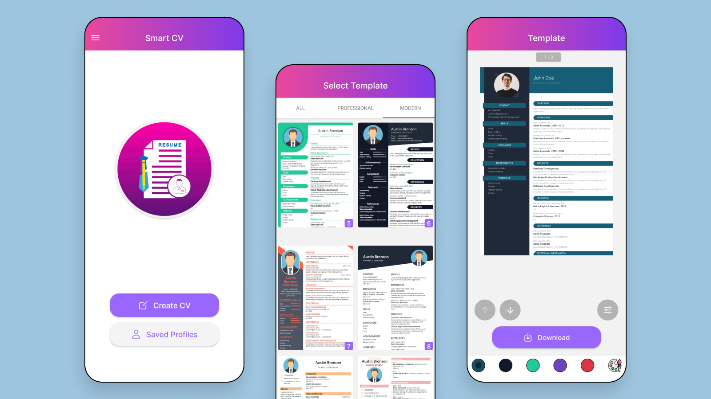

# Smart CV – React Native (Freelance Project)

## 🧭 Overview

**Smart CV** is a mobile app that helps users create polished, professional resumes in minutes — no design experience needed.

It built with **React Native** and **Expo** that offers customizable templates, smooth UX, offline editing, and export-ready PDF generation. Designed for freelancers, job seekers, and professionals, the app simplifies the resume creation process without requiring design skills.

**[View on Google Play](https://play.google.com/store/apps/details?id=com.thinknxtmedia.smartcv)**



---

## ✨ Features

- **Create & Edit Resumes**  
  Users can easily add and organize their skills, experiences, education, and personal details.

- **Beautiful Templates**  
  Export resumes using professionally designed templates rendered with HTML + CSS.

- **PDF Export**  
  Generate print-ready, shareable PDFs that look great on any device.

- **Color & Theme Customization**  
  Choose from multiple color themes and personalize visual settings.

- **Offline Support**  
  All data is saved locally, with no sign-in or internet required.

- **Ad Integration**  
  Monetized with Google AdMob using rewarded and interstitial ads.

---

## 🛠 Tech Stack

- **Framework**: React Native (Expo SDK)
- **PDF Generator**: Custom HTML/CSS templates via `expo-print`
- **UI Libraries**: Tamagui, Reanimated
- **Navigation**: React Navigation
- **State Management**: Zustand
- **Local Storage**: AsyncStorage
- **Image & File Handling**: Expo Image Picker, rn-fetch-blob
- **Ad Support:** Google Mobile Ads (AdMob)
- **PDF Viewer**: `@bildau/rn-pdf-reader`

---

## 📁 Project Structure

```bash
smart-cv/
├── App.js
├── app.json
├── assets/
├── components/               # Reusable UI components
├── composables/              # Custom hooks and logic
├── constant/                 # Global styles, settings, data
├── models/
├── navigators/               # Navigation structure
├── pdf-templates/            # Vite-based resume template engine
│   ├── src/
│   │   ├── components/
│   │   └── templates/
│   ├── vite.config.js
│   └── index.html
├── screen/                   # App screens by feature
├── features/                 # App-wide feature modules and service wrappers
├── services/                 # Ad services and wrappers
├── store/                    # Zustand stores
├── util/                     # Utility functions
├── tamagui.config.js
├── theme.js
└── README.md
```

---

## 🚀 Getting Started

### Prerequisites

- Node.js ≥ 16
- Expo CLI (`npm install -g expo-cli`)

### Installation

```bash
yarn install
npx expo start
```

---

## 👤 Role

This project was designed and developed by **Hasan Mahmud** as a **solo developer**.

---

## 🧾 Portfolio Note

**Smart CV** is part of my developer portfolio and showcases my ability to design, build, and ship high-quality mobile apps using React Native.
This project reflects my focus on clean architecture, intuitive UX, and efficient state management.

Feel free to explore the code — and reach out if you're hiring or interested in collaboration!

---

## 📬 Contact

- **Email**: [hasansujon786@gmail.com](mailto:hasansujon786@gmail.com)
- **GitHub**: [github.com/hasansujon786](https://github.com/hasansujon786)
- **Portfolio**: [hasansujon786.github.io](https://hasansujon786.github.io)

---

🛡 License

This project is currently not licensed for public use.
You may view or explore the code, but reproduction, redistribution, or reuse is not permitted without explicit permission from the author.

📩 For inquiries, please contact the author directly.
